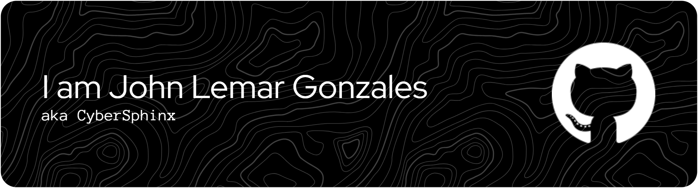

<!-- 
<h1 align="center">𝐈'𝐦 𝐉𝐨𝐡𝐧 𝐋𝐞𝐦𝐚𝐫 𝐆𝐨𝐧𝐳𝐚𝐥𝐞𝐬 (𝐚𝐤𝐚 𝐂𝐲𝐛𝐞𝐫𝐒𝐩𝐡𝐢𝐧𝐱)</h1>
-->
<h2 align="center">𝐀 𝐋𝐢𝐟𝐞𝐥𝐨𝐧𝐠 𝐥𝐞𝐚𝐫𝐧𝐞𝐫 𝐢𝐧 𝐈𝐓</h2>

  

<h3 align="left">Introduction</h3>

Web Developer, Programmer, Philanthropist, and Student Leader.

<ul>
  <li>🏫 BSIT, University of Science and Technology of Southern Philippines, CDO</li>
  <li>🌱 Currently learning <strong>C, Python, Java, Linux, Ethical Hacking, HTML, CSS, JavaScript, Game Development, Unreal Engine, Unity, Godot, Flutter</strong></li>
  <li>⚒️ Currently Working on: <a href="https://github.com/CyberSphinxxx/StudentHub"><strong>StudentHub</strong></a></li> 
  <li>💬 Ask me about <strong>Web Development and CyberSecurity</strong></li>
  <li>📫 How to reach me: <a href="mailto:johnlemargonzales@gmail.com">johnlemargonzales@gmail.com</a></li>
  <li>📄 Know about my experiences: <a href="https://drive.google.com/file/d/11hbulKKPnj12hJPeKxfnRlMxNJbCt9AM/view?usp=drive_link" target="_blank">Resume (Not Updated)</a></li>
</ul>

## Experiences

Explore my professional experiences on [LinkedIn](https://linkedin.com/in/john-lemar-gonzales-28011b28b).

## Connect with me:

  

  

  

  

<h1 align="center">Languages & Tools</h1>

  

<h1 align="center">PERSONAL HUB</h1>

  
  
  &nbsp;&nbsp;

<h3 align="left">Support:</h3>

<a href="https://ko-fi.com/johnlemargonzales"> 

  

## 🔔 GitHub Activity
<!--START_SECTION:activity-->
1. 🚀 Published release [🚀 Release v1.0.0 – Initial Expo App Setup  ](https://github.com/MobileProgramming-USTP/mobile-prog/releases/tag/v1.0.0) in [MobileProgramming-USTP/mobile-prog](https://github.com/MobileProgramming-USTP/mobile-prog)
2. 🚀 Published release [AlbionOnline-ObjectDetection - V1.0.0](https://github.com/CyberSphinxxx/Albion-Online-Object-Detection/releases/tag/v1.0.0) in [CyberSphinxxx/Albion-Online-Object-Detection](https://github.com/CyberSphinxxx/Albion-Online-Object-Detection)
3. 🗣 Commented on [#39](https://github.com/gdgoc-ustp/USTP-Website/pull/39#issuecomment-3243911008) in [gdgoc-ustp/USTP-Website](https://github.com/gdgoc-ustp/USTP-Website)
<!--END_SECTION:activity-->

---

# 🚀 Projects

Check out some of my favorite projects below!

  
Click to show/hide projects

  
<table style="width: 660px; border-collapse: separate; border-spacing: 20px 15px;">
  <tr>
    <td style="border: 2px solid #333; border-radius: 10px; padding: 20px; width: 300px; background-color: #f9f9f9; vertical-align: top;">
      <h3><a href="https://github.com/CyberSphinxxx/AsciiWizard">AsciiWizard</a></h3>
      
A modern, user-friendly ASCII, Binary, and Text converter built with pure HTML, CSS, and JavaScript.  <a href="https://ascii-wizard.vercel.app">Live Demo</a>

    </td>
    <td style="border: 2px solid #333; border-radius: 10px; padding: 20px; width: 300px; background-color: #f9f9f9; vertical-align: top;">
      <h3><a href="https://github.com/CyberSphinxxx/GuessTheNumber">GuessTheNumber</a></h3>
      
A simple random number guessing game built using HTML, CSS, JS.  <a href="https://cybersphinx-guessthenumber.vercel.app">Live Demo</a>

    </td>
  </tr>
  <tr>
    <td style="border: 2px solid #333; border-radius: 10px; padding: 20px; width: 300px; background-color: #f9f9f9; vertical-align: top;">
      <h3><a href="https://github.com/CyberSphinxxx/CaseFlow">CaseFlow</a></h3>
      
CaseFlow is a lightweight and efficient text transformation tool designed to simplify case formatting.  <a href="https://case-flow-text-formatter.vercel.app">Live Demo</a>

    </td>
    <td style="border: 2px solid #333; border-radius: 10px; padding: 20px; width: 300px; background-color: #f9f9f9; vertical-align: top;">
      <h3><a href="https://github.com/CyberSphinxxx/RandomQuoteGenerator">RandomQuoteGenerator</a></h3>
      
An inspirational quote generator web application built using HTML, CSS, and JavaScript, using the InspiroBot API.  <a href="https://random-quote-generator-jlg.vercel.app">Live Demo</a>

    </td>
  </tr>
  <tr>
    <td style="border: 2px solid #333; border-radius: 10px; padding: 20px; width: 300px; background-color: #f9f9f9; vertical-align: top;">
      <h3><a href="https://github.com/CyberSphinxxx/OddEvenBruteForceGen">OddEvenBruteForceGen</a></h3>
      
A ridiculously over-the-top tool that generates brute force code to check if numbers are odd or even.  <a href="https://brute-force-odd-or-even.vercel.app">Live Demo</a>

    </td>
    <td style="border: 2px solid #333; border-radius: 10px; padding: 20px; width: 300px; background-color: #f9f9f9; vertical-align: top;">
      <h3><a href="https://github.com/CyberSphinxxx/NewYear-Countdown-Timer">NewYear-Countdown-Timer</a></h3>
      
A simple countdown timer for New Year's Eve.  <a href="https://new-year-countdown-timer-murex.vercel.app">Live Demo</a>

    </td>
  </tr>
  <tr>
    <td style="border: 2px solid #333; border-radius: 10px; padding: 20px; width: 300px; background-color: #f9f9f9; vertical-align: top;">
      <h3><a href="https://github.com/CyberSphinxxx/Aesthetic-Linktree">Aesthetic-Linktree</a></h3>
      
An aesthetic version of my linktree.  <a href="https://johnlemargonzales-aesthetic-profile.vercel.app">Live Demo</a>

    </td>
    <td style="border: 2px solid #333; border-radius: 10px; padding: 20px; width: 300px; background-color: #f9f9f9; vertical-align: top;">
      <h3><a href="https://github.com/CyberSphinxxx/Infinity-Sweeper">Infinity-Sweeper</a></h3>
      
An infinite Minesweeper game using HTML, CSS, and JavaScript.  <a href="https://infinity-sweeper.vercel.app">Live Demo</a>

    </td>
  </tr>
  <tr>
    <td style="border: 2px solid #333; border-radius: 10px; padding: 20px; width: 300px; background-color: #f9f9f9; vertical-align: top;">
      <h3><a href="https://github.com/CyberSphinxxx/PasswordSentinel-JavaSwing">PasswordSentinel - Java Version</a></h3>
      
A secure password manager built with Java Swing.  No Live Demo

    </td>
    <td style="border: 2px solid #333; border-radius: 10px; padding: 20px; width: 300px; background-color: #f9f9f9; vertical-align: top;">
      <h3><a href="https://github.com/CyberSphinxxx/ShopScout-CDO">ShopScout-CDO</a></h3>
      
CDO ShopFinder is an open-source store locator powered by OpenStreetMap for Cagayan de Oro City.  <a href="https://cybersphinxxx.github.io/ShopScout-CDO/">Live Demo</a>

    </td>
  </tr>
  <tr>
    <td style="border: 2px solid #333; border-radius: 10px; padding: 20px; width: 300px; background-color: #f9f9f9; vertical-align: top;">
      <h3><a href="https://github.com/CyberSphinxxx/MNHS-Scout-Portal">MNHS-Scout-Portal</a></h3>
      
Macasandig National High School Senior Scouts Website.  <a href="https://macasandignhs-scout-portal.vercel.app">Live Demo</a>

    </td>
    <td style="border: 2px solid #333; border-radius: 10px; padding: 20px; width: 300px; background-color: #f9f9f9; vertical-align: top;">
      <h3><a href="https://github.com/CyberSphinxxx/LinkHub">LinkHub</a></h3>
      
LinkHub: Personal Socials Directory.  <a href="https://link-hub-os.vercel.app">Live Demo</a>

    </td>
  </tr>
  <tr>
    <td style="border: 2px solid #333; border-radius: 10px; padding: 20px; width: 300px; background-color: #f9f9f9; vertical-align: top;">
      <h3><a href="https://github.com/CyberSphinxxx/FlexBoxer">FlexBoxer</a></h3>
      
Organize and play with boxes in a flexible layout.  <a href="https://flex-boxer.vercel.app">Live Demo</a>

    </td>
    <td style="border: 2px solid #333; border-radius: 10px; padding: 20px; width: 300px; background-color: #f9f9f9; vertical-align: top;">
      <h3><a href="https://github.com/CyberSphinxxx/Cute-Date-Planner">Cute-Date-Planner</a></h3>
      
This application helps you plan your perfect dates, add, filter, and manage date ideas effortlessly.  <a href="https://cutedateplanner.vercel.app">Live Demo</a>

    </td>
  </tr>
  <tr>
    <td style="border: 2px solid #333; border-radius: 10px; padding: 20px; width: 300px; background-color: #f9f9f9; vertical-align: top;">
      <h3><a href="https://github.com/CyberSphinxxx/Ink-Animation-Intro">Ink-Animation-Intro</a></h3>
      
A visually stunning intro animation using a GIF-based ink mask for a modern design.  <a href="https://ink-animation-intro.vercel.app">Live Demo</a>

    </td>
    <td style="border: 2px solid #333; border-radius: 10px; padding: 20px; width: 300px; background-color: #f9f9f9; vertical-align: top;">
      <h3><a href="https://github.com/CyberSphinxxx/PasswordSentinel">PasswordSentinel</a></h3>
      
PasswordSentinel is a secure, local-only password manager built with HTML5, CSS3, and JavaScript.  <a href="https://password-sentinel.vercel.app">Live Demo</a>

    </td>
  </tr>
  <tr>
    <td style="border: 2px solid #333; border-radius: 10px; padding: 20px; width: 300px; background-color: #f9f9f9; vertical-align: top;">
      <h3><a href="https://github.com/CyberSphinxxx/WeatherNow">WeatherNow</a></h3>
      
A simple weather and city temperature monitoring app made with HTML, CSS, and JavaScript.  <a href="https://cybersphinxxx.github.io/WeatherNow/">Live Demo</a>

    </td>
    <td style="border: 2px solid #333; border-radius: 10px; padding: 20px; width: 300px; background-color: #f9f9f9; vertical-align: top;">
      <h3><a href="https://github.com/CyberSphinxxx/prisoners-dilemma-simulator">Prisoner's Dilemma Simulator</a></h3>
      
This Python program simulates the Prisoner's Dilemma, allowing players to choose from various strategies.  No Live Demo

    </td>
  </tr>
  <tr>
    <td style="border: 2px solid #333; border-radius: 10px; padding: 20px; width: 300px; background-color: #f9f9f9; vertical-align: top;">
      <h3><a href="https://github.com/CyberSphinxxx/Interactive_Code_Editor">Interactive_Code_Editor</a></h3>
      
A simple HTML code editor allowing users to write and run HTML code in real-time with an in-browser preview.  <a href="https://cybersphinxxx.github.io/Interactive_Code_Editor/">Live Demo</a>

    </td>
    <td style="border: 2px solid #333; border-radius: 10px; padding: 20px; width: 300px; background-color: #f9f9f9; vertical-align: top;">
      <h3><a href="https://github.com/CyberSphinxxx/TypeGlow">TypeGlow</a></h3>
      
TypeGlow is an interactive typing practice tool designed to improve typing accuracy and speed.  <a href="https://typeglow.vercel.app">Live Demo</a>

    </td>
  </tr>
  <tr>
    <td style="border: 2px solid #333; border-radius: 10px; padding: 20px; width: 300px; background-color: #f9f9f9; vertical-align: top;">
      <h3><a href="https://github.com/CyberSphinxxx/CircumferenceCalculator">CircumferenceCalculator</a></h3>
      
A simple web-based calculator that computes the circumference of a circle given its radius.  <a href="https://cybersphinxxx.github.io/CircumferenceCalculator/">Live Demo</a>

    </td>
    <td style="border: 2px solid #333; border-radius: 10px; padding: 20px; width: 300px; background-color: #f9f9f9; vertical-align: top;">
      <h3><a href="https://github.com/CyberSphinxxx/TimeNow">TimeNow</a></h3>
      
TimeNow is a simple web app that allows users to enter any city or country to get the current local time.  <a href="https://time-now-gamma.vercel.app">Live Demo</a>

    </td>
  </tr>
  <tr>
    <td style="border: 2px solid #333; border-radius: 10px; padding: 20px; width: 300px; background-color: #f9f9f9; vertical-align: top;">
      <h3><a href="https://github.com/CyberSphinxxx/RestaurantBillingCProgramming">RestaurantBillingCProgramming</a></h3>
      
A basic restaurant program in C that lets users see the menu, pick items, shows a bill, and figures out change.  No Live Demo

    </td>
    <td style="border: 2px solid #333; border-radius: 10px; padding: 20px; width: 300px; background-color: #f9f9f9; vertical-align: top;">
      <h3><a href="https://github.com/CyberSphinxxx/Online_3D_Touring_Using_Roblox-Studio">Online_3D_Touring_Using_Roblox-Studio</a></h3>
      
Examines the effectiveness of 3D museum tours using Roblox Studio, focusing on the City Museum of Cagayan de Oro and Heritage Studies Center.  No Live Demo

    </td>
  </tr>
</table>

  <a href="https://github.com/CyberSphinxxx?tab=repositories">See All My Projects</a>

---
